## Today's concept:

1-tier, 2-tier, 3-tier, n-tier architectures. Draw each. Read Scaler's client-server explainer.

## Day 2 — Client-Server Model

*1-tier, 2-tier, 3-tier, n-tier architectures*

Today's topic is deceptively simple — and that's why most beginners skim it and pay the price later. Every single system you'll ever design in an interview (TinyURL, Uber, WhatsApp, Netflix) is fundamentally a **client-server system** split into tiers. If you don't understand *why* we split systems into tiers and *what trade-off each split buys*, you'll be drawing architecture diagrams by pattern-matching instead of reasoning.

#### What is the client-server model?

At its core, the client-server model is a relationship between two roles:

- **Client** — the one who *asks* for something (a browser, a mobile app, another microservice, even a cron job hitting an API)
- **Server** — the one who *provides* something (data, computation, a file, a response)

The key insight most beginners miss: **client-server is a role, not a machine.** The same machine can be a client in one interaction and a server in another. When your API server queries a database, your API server is the *client* and the database is the *server*. When a user's browser hits your API, the browser is the client and the API is the server.

> **Example:** Think about Swiggy. Your phone (client) sends a request to Swiggy's API server. But Swiggy's API server then acts as a *client* to the restaurant's menu database, to the payment gateway, to the delivery tracking service. Each hop is a client-server interaction.

----------------------------------------------------------

#### The evolution: 1-tier → 2-tier → 3-tier → n-tier

The "tier" concept is about **how you split responsibilities across separate processes or machines**. Let's walk through the evolution — each tier solves a real problem but introduces a new one.

----------------------------------------------------------

##### 1-Tier Architecture (Monolithic / single machine)

Everything — the UI, the business logic, and the data — lives on **one machine** in **one process**.

**Real-world examples:**
- A desktop calculator app
- Microsoft Excel running locally
- A single-player video game
- Your personal notes app running offline on your laptop

**Advantages:**
- Zero network latency (everything is in-memory or local disk)
- Simple to build and debug
- No deployment complexity

**Disadvantages:**
- Cannot scale beyond one machine
- If the machine dies, everything dies
- Multiple users can't access the same data simultaneously
- No separation of concerns — UI changes require redeploying the whole thing

> **The question that breaks 1-tier:** "What happens when a second user wants to access the same data from a different device?"
>
> That single question is what forces us to 2-tier.

----------------------------------------------------------

##### 2-Tier Architecture (Client-Server)

Split into two layers: the **client** (UI + some logic) runs on the user's machine, and a **server** (data + some logic) runs on a shared machine.

**Real-world examples:**
- Early database applications (a desktop app connecting directly to a MySQL server)
- A mobile banking app that talks directly to a database
- Many internal enterprise tools (a thick client connecting to an Oracle DB)

**How it works:**

The client handles presentation and some business logic. The server handles data storage and some data logic. The client talks directly to the server — usually the database itself.

**Advantages:**
- Multiple clients can share the same data
- Data lives on a central server (backup, consistency)
- Some separation of concerns

**Disadvantages:**
- Business logic is split awkwardly between client and server — hard to maintain
- Client has direct database access (security nightmare)
- Every new client (web, mobile, desktop) must re-implement the business logic
- Database connection limits become a bottleneck fast

> **The question that breaks 2-tier:** "What if we need a web app AND a mobile app? Do we duplicate all the business logic in both clients?"
>
> That's what pushes us to 3-tier.

----------------------------------------------------------

##### 3-Tier Architecture (The standard)

Split into three clean layers:
1. **Presentation tier** (Client) — what the user sees and interacts with
2. **Application/Logic tier** (Server) — business rules, validation, orchestration
3. **Data tier** (Database) — persistent storage

**Real-world examples:**
- Almost every modern web application (React frontend → FastAPI/Express backend → PostgreSQL)
- Swiggy: mobile app → API servers → databases
- Instagram: app → backend services → databases + object storage

**How it works:**

The client *never* talks to the database directly. It talks to the application server, which enforces business rules and then talks to the database. This is the architecture you'll use in 90% of your interview designs.

**Advantages:**
- Clean separation of concerns — each tier can be developed, deployed, and scaled independently
- Security: clients never touch the database
- Multiple client types (web, mobile, CLI) share the same backend logic
- Each tier can scale independently (add more app servers without touching the DB)

**Disadvantages:**
- More network hops = more latency
- More moving parts = more things that can fail
- Deployment is more complex

> **Example breakdown — how Swiggy works in 3 tiers:**
> - **Presentation:** The Swiggy mobile app on your phone. Shows restaurants, menus, cart.
> - **Application:** Swiggy's backend servers. Handle search, pricing, order placement, delivery matching.
> - **Data:** PostgreSQL for orders, Redis for session/cache, S3 for restaurant images.

----------------------------------------------------------

##### N-Tier Architecture (Microservices era)

When 3 tiers aren't enough, you split the application tier into **multiple specialised services**, each with its own responsibility and often its own database.

**Real-world examples:**
- Netflix: hundreds of microservices (recommendation, streaming, billing, user profiles — each is its own service)
- Uber: separate services for matching, pricing, maps, payments, notifications
- Amazon: the classic example — started as a monolith, split into 100+ services

**How it works:**

Instead of one big application server, you have many smaller ones. An API gateway sits in front, routing requests to the right service. Each service owns its own data. Services communicate via REST, gRPC, or message queues.

**Advantages:**
- Each service can be built, deployed, and scaled independently
- Teams can own individual services (organisational scaling)
- Technology diversity — service A can use Python, service B can use Go
- Fault isolation — if the recommendation service crashes, you can still place orders

**Disadvantages:**
- Distributed system complexity (network failures, consistency, debugging)
- Data consistency across services is hard (no more simple SQL joins)
- Operational overhead (monitoring, deployment, service discovery)
- "Microservices tax" — you need infrastructure maturity before this pays off

> **Key insight:** N-tier is NOT automatically better than 3-tier. Many successful companies run on a well-structured monolith. The trade-off is: *monolith = simpler to build, harder to scale per-component. Microservices = harder to build, easier to scale per-component.* Interviewers love hearing candidates reason about this trade-off instead of defaulting to microservices.

----------------------------------------------------------
Let me show you how these tiers look visually — this is the kind of diagram you'd draw on a whiteboard in an interview.

> Each split buys flexibility but costs latency and complexity.
> **More tiers ≠ better.** Choose the simplest tier that meets your constraints.

Now let me show how a real 3-tier request flows end-to-end — this is the mental model you should carry into every future design.---

#### Concrete examples: mapping real apps to tiers

Let me ground this further with apps you actually use:

| App | Presentation tier | Application tier | Data tier |
|---|---|---|---|
| **WhatsApp** | Mobile app | Message routing servers, presence service | Cassandra (messages), S3 (media) |
| **YouTube** | Web/mobile app | Upload service, transcoding pipeline, recommendation engine | Bigtable (metadata), GCS (video files) |
| **ChatGPT** | Web/mobile UI | API servers, inference orchestrator | PostgreSQL (users), model weights (GPU cluster) |
| **Swiggy** | Mobile app | Search, ordering, delivery matching, payments | PostgreSQL, Redis, Elasticsearch |

Notice how every one of these is at minimum 3-tier, and most are n-tier with specialised services behind the scenes.

----------------------------------------------------------

#### A common confusion: tiers vs layers

This trips people up in interviews:

- **Tier** = a physically or logically separate deployment unit. Different tiers *can* run on different machines and scale independently.
- **Layer** = a logical separation *within* the same codebase. Your FastAPI app might have a routing layer, a service layer, and a data-access layer — but they all deploy together as one tier.

You can have 3 layers inside 1 tier. You can have 1 layer spread across 3 tiers. They are orthogonal concepts.

----------------------------------------------------------

### Points to remember

- **Client-server is a role, not a machine.** The same process can be both.
- **A tier is a deployment boundary.** Each tier can scale, fail, and be updated independently.
- **Every tier split buys flexibility but costs latency + complexity.** This is the fundamental trade-off.
- **3-tier is the default** for most interview designs. Start here unless you have a reason not to.
- **N-tier (microservices) is not automatically better.** Many successful companies run on well-structured monoliths. Interviewers want you to reason about *when* to split, not blindly split everything.
- **Tiers ≠ layers.** Tiers are deployment boundaries. Layers are code organisation within a tier.
- **The "thick client vs thin client" spectrum:** A 1-tier app is the thickest client. A web app that renders everything server-side is the thinnest. Most modern apps sit in between (React frontend + API backend).

----------------------------------------------------------

### Answer these in your own words after thinking (3–5 sentences each):

1. Think about a simple **todo app** (like Todoist). If you were building it for just yourself on your laptop, what tier would it be? Now imagine 10,000 users need it — what tier does it become and why?

A. Since it is a simple Todo application that I am building only for myself, I would choose a monolithic application because it is simple to develop, deploy, and maintain. As there is only one user, I don't need to worry about scalability.
If the application needs to support around 10,000 users, I would still prefer a monolithic application initially because it is easier to manage. As the number of users increases further or the application becomes more complex, I can later think about separating the components into different services if needed.

A2. For just myself on my laptop, this is a 1-tier application. The UI, the logic (add/edit/delete tasks), and the data (a local SQLite file or even a JSON file) all live on one machine in one process. No network, no server, no complexity.
When 10,000 users need it, two things change: first, every user needs access to the same data from different devices; second, I can't trust client devices with direct database access. Both problems force me to at least 3-tier:
Presentation tier — the mobile/web app on each user's device, handling UI rendering and user input.
Application tier — a backend server that handles authentication, validates inputs, enforces business rules (e.g., "only the list owner can delete the list"), and serves a shared API that all clients use.
Data tier — a centralized database (PostgreSQL or even SQLite on a server for 10K users) that stores all tasks.
I'd still deploy this as a monolith — one backend codebase, one database. Monolith vs microservices is a deployment decision; 3-tier is an architectural separation. At 10K users, a single well-structured monolith is more than sufficient.

2. Pick either Instagram or YouTube. Identify at least **3 separate services** in their application tier that you think exist. Why would they split these instead of keeping one big server?

A. In Instagram, The services and their reason to split it instead of keeping one big servers are:
1. Feed Service retrieves posts from accounts a user follows, ranks them, and prepares the home feed. Since feed generation is computationally expensive, it benefits from independent scaling.
2. Messaging Service handles direct messages, message delivery, read receipts, and synchronization across devices. Separating it prevents messaging traffic from impacting feed performance.
3. Upload Service manages media uploads, validation, storage, metadata generation, and triggers downstream processing such as image optimization. Since uploads involve large files and asynchronous processing, isolating this service improves scalability and maintainability.

In Youtube:
1. Upload Service: This service is responsible for uploading videos to the platform. Since uploading videos is a separate functionality, keeping it as an independent service reduces complexity and makes debugging easier.
2. Video Service: This service is responsible for retrieving video details and displaying videos to users. Separating this functionality keeps the application organized and makes it easier to manage video-related features.
3. User Service: This service manages user-related information such as subscribed channels, liked videos, disliked videos, and watch history. Keeping user-related operations in a separate service makes the application easier to maintain and extend.

A2.Instagram: 
1. Feed Service — generates the home feed by fetching posts from followed accounts, ranking them by relevance, and returning the final ordered list. Feed generation is CPU-intensive and read-heavy, so it needs to scale independently from write-heavy services like uploads. If feed ranking slows down, it shouldn't affect a user's ability to post.
2. Messaging Service — handles direct messages, delivery receipts, and real-time sync across devices. Messaging is a persistent-connection workload (WebSockets), which is fundamentally different from the request-response pattern of feed or upload. Mixing them in one server means a spike in DMs could starve feed requests of connections.
3. Upload Service — handles media uploads, validates file types/sizes, stores originals in object storage (like S3), and triggers async processing (thumbnail generation, image compression, content moderation). Uploads involve large payloads and long-running async jobs — isolating this prevents a slow upload from blocking a fast feed request.

YouTube:
1. Upload & Transcoding Service — accepts raw video files, stores them, and kicks off transcoding into multiple resolutions (360p, 720p, 1080p, 4K). This is the most resource-hungry service — it needs GPU/CPU-heavy machines and can take minutes per video. If this ran on the same servers that serve video playback, a batch of uploads would degrade streaming for millions of viewers.
2. Video Serving Service — handles video playback requests, selects the right resolution based on the user's bandwidth, and coordinates with CDN edge servers. This is extremely read-heavy (billions of views/day vs millions of uploads/day), so it needs to scale to a completely different degree than the upload service.
3. User Service — manages profiles, subscriptions, watch history, likes/dislikes, and playlists. This is a lightweight CRUD service compared to video serving. Keeping it separate means a bug in subscription logic doesn't risk taking down video playback — the core revenue-generating feature.

3. **The trade-off question:** A startup founder says "Let's build microservices from day one so we're ready to scale." You're the senior engineer. What do you tell them?
A. I would first understand what kind of application we are building and who the users are. Based on the product requirements, I would decide the architecture.
For a startup, I would not immediately choose microservices. I would prefer starting with a monolithic application because it is easier to develop, deploy, and maintain. As the application grows and the number of users increases, we can later split it into microservices if required.
Choosing the right architecture should depend on the application's needs rather than following a trend.

A2. At our stage, we have a small team, no users yet, and our biggest risk is building something nobody wants. A monolith lets us move fast: one codebase, one deployment, one database, one debugging context. We can ship features in days, not weeks.
If we go microservices now, before our first user, we'll spend weeks building infrastructure that doesn't serve customers: service discovery, inter-service communication, distributed tracing, separate CI/CD pipelines for each service, and contract testing between services. That's engineering effort with zero user value.
What I'd do instead: build a well-structured monolith with clean internal boundaries — a service layer, a data layer, clear module separation. If and when we hit a scaling bottleneck or our team grows to 15+ engineers stepping on each other's code, then we extract the bottleneck into a separate service. That's how Instagram, Shopify, and many successful companies did it.

----------------------------------------------------------
### Resources

- **Scaler — Client-Server Architecture** — https://www.scaler.com/topics/system-design/client-server-architecture/
- **System Design Primer — Scalability section** (covers why we split tiers as traffic grows) — https://github.com/donnemartin/system-design-primer#scalability

**Videos:**
- **ByteByteGo — "What happens when you type a URL in your browser"** — https://www.youtube.com/@ByteByteGo (search this title — it beautifully shows the multi-tier request flow)
- **Gaurav Sen — "What is a Client-Server Architecture?"** — https://www.youtube.com/@gkcs

**Reference (skim, don't deep-read):**
- **roadmap.sh — Client-Server Model** — https://roadmap.sh/system-design
- **MDN Web Docs — Client-Server overview** — https://developer.mozilla.org/en-US/docs/Learn/Server-side/First_steps/Client-Server_overview
- **AWS Well-Architected — Multi-tier architectures** — https://aws.amazon.com/architecture/

----------------------------------------------------------
### Mini-interview section
Now let's apply what you learned. I'm going to act as your interviewer. Here's a small, focused problem — not a full system design yet, just enough to exercise the tier concept.

Problem: You're building a shared grocery list app. Multiple family members can add items, check them off, and see updates in real-time from their phones.
Right now, it's just a notes file on one phone. Your job: evolve it.

Question 1 — Tier selection:
What tier architecture would you choose for this app, and why? Walk me through your reasoning. Don't just say "3-tier" — tell me why each tier exists in your design and what goes where.

A. I would choose a 2-tier architecture for this application. One tier would contain the presentation layer along with the application logic, and the second tier would be the database.
I chose this architecture because the application is relatively simple, and having a separate application layer may add unnecessary complexity. The presentation tier can handle user interactions, authentication, retrieving the grocery list, and updating items, while the database tier stores all the shared grocery list data in a centralized location.
Since multiple family members need access to the same list, keeping the database separate allows everyone to view the latest updates. For a simple shared grocery list application, I believe a 2-tier architecture would be sufficient and easier to develop and maintain. 
But if the application should be available on different devices like Andriod, iPhone, and Web Browser - I would have authentication and business logic inside one common place. So I would go with 3-tier architecture.

A2. I'd choose a 3-tier architecture. Here's my reasoning for each tier:
Presentation tier (mobile apps + optional web app): Each family member accesses the list from their own device. The client handles rendering the grocery list UI, capturing user input (adding items, checking them off), and displaying real-time updates from other family members. Since we need to support multiple platforms (at minimum Android and iOS), keeping the client thin and the logic server-side means we write the business rules once.
Application tier (backend API server): This is the shared brain. It handles authentication (who is this user?), authorization (is this user a member of this family's list?), business logic (prevent duplicate items, merge conflicts if two people edit simultaneously), and — critically — real-time sync. Since the requirement says family members should see updates in real-time, the server needs to push changes to all connected clients. I'd use WebSockets for this: when one person adds "Milk," the server broadcasts that update to every other family member's phone immediately.
Data tier (database): Stores the grocery lists, items, user accounts, and family group memberships. A simple PostgreSQL database would handle 10,000 families easily. I'd consider adding Redis for managing WebSocket session state and pub/sub for real-time broadcasting across multiple server instances.
I chose 3-tier over 2-tier because in 2-tier, each client would need to connect directly to the database and contain its own business logic — that means duplicating validation rules across Android, iOS, and web, and exposing the database to the internet. The application tier solves both problems.