## Day 3 — How the Internet Works

*IP, TCP, UDP, packets, routers*

Today we go underneath the applications you've been designing and look at the plumbing. When you said "the mobile app sends a request to the API server" on Day 2, something *actually happened* between those two machines — data physically traveled across the internet. Today you'll understand exactly what that journey looks like, and more importantly, *why it works the way it does*.

This matters for system design because every time you draw an arrow between two boxes in an architecture diagram, that arrow has **latency**, **bandwidth limits**, and **failure modes**. If you don't understand the network layer, you can't reason about why your system is slow, why messages get lost, or why you need retries.

---

### Block 1 — Learn (40–60 min)

#### The Big Picture: How does data travel across the internet?

When you open Swiggy on your phone and search for "biryani," here's what actually happens at the network level:

1. Your phone creates a **message** ("GET /search?q=biryani")
2. That message gets chopped into small **packets** (like tearing a letter into numbered pieces)
3. Each packet gets wrapped in **envelopes** with addressing information (IP addresses)
4. The packets hop across multiple **routers** (like post offices forwarding mail)
5. They arrive at Swiggy's server, get reassembled in order, and the server processes the request
6. The response takes the same journey back

The internet is NOT a direct wire between your phone and the server. It's a mesh of interconnected networks (literally "inter-net"), and your data bounces through 10-20 intermediate machines to reach its destination.

> **Example you can try right now:** Open your terminal and run `traceroute google.com` (Mac/Linux) or `tracert google.com` (Windows). You'll see every router your data hops through to reach Google. Count them — there are probably 10-15 hops, each adding a few milliseconds of latency.

---

#### The OSI Model (simplified to what matters)

The full OSI model has 7 layers. For system design, you need to deeply understand 4 of them. The rest are nice-to-know.

| Layer | Name | What it does | System design relevance |
|---|---|---|---|
| 7* | Application | HTTP, gRPC, WebSocket, DNS | You design at this layer (APIs, protocols) |
| 6 | Presentation | Formats/translates data — encryption, compression, encoding (TLS, JPEG, ASCII/UTF-8) | Rarely modeled explicitly, but TLS termination (HTTPS at your load balancer) lives here |
| 5 | Session | Opens, manages, and closes sessions between two apps (sockets, RPC sessions) | Shows up as "sticky sessions" on load balancers and long-lived WebSocket/gRPC connections |
| 4* | Transport | TCP, UDP | You choose between reliability vs speed |
| 3* | Network | IP, routing | You reason about latency, regions, VPCs |
| 2* | Data Link | Ethernet, WiFi | Rarely relevant in design interviews |
| 1 | Physical | Raw bits over cables, fiber optics, radio signals, voltage/light pulses | Rarely relevant — surfaces only when reasoning about physical datacenter/network infrastructure |

Think of it like sending a package via courier:
- **Application layer** = the letter you wrote (your actual message)
- **Transport layer** = whether you chose registered mail with tracking (TCP) or dropped it in a mailbox with no confirmation (UDP)
- **Network layer** = the addressing system and route the courier takes (IP addresses, routers)
- **Data Link layer** = the physical truck carrying the package (Ethernet cable, WiFi signal)

---

#### IP — Internet Protocol (Network Layer)

IP is the **addressing system** of the internet. Every device connected to the internet has an IP address — it's like a postal address for machines.

**IPv4** — the classic format: `192.168.1.1`. Four numbers (0-255), separated by dots. That gives us ~4.3 billion addresses. We've already run out.

**IPv6** — the replacement: `2001:0db8:85a3:0000:0000:8a2e:0370:7334`. 128-bit addresses — enough for every grain of sand on earth to have its own address. Adoption is slow but growing.

**Key properties of IP:**
- **Connectionless** — each packet is routed independently. Two consecutive packets might take different paths.
- **Best-effort delivery** — IP does NOT guarantee that your packet arrives. It might get lost, duplicated, or arrive out of order. It just tries its best.
- **No reliability** — if you need guarantees, you add TCP on top.

> **Analogy:** IP is like the postal system. You put an address on the envelope, drop it in the mailbox, and hope it arrives. The post office doesn't call you to confirm delivery. It doesn't guarantee your letters arrive in order. It just routes them toward the destination.

**What interviewers care about:**
- IP addresses determine network topology (VPCs, subnets, public vs private IPs)
- Latency between two IP addresses depends on physical distance and number of router hops
- Private IP ranges (10.x.x.x, 172.16.x.x, 192.168.x.x) are used inside cloud VPCs — they can't be reached from the public internet

---

#### Packets — How data actually travels

Your HTTP request ("GET /search?q=biryani") might be 500 bytes. But what if you're uploading a 10MB photo? You can't send 10MB as one continuous stream — that would block the entire network path for seconds.

Instead, the data gets split into **packets** — small chunks, typically 1,500 bytes each (the MTU — Maximum Transmission Unit).

Each packet contains:
- **Header** — source IP, destination IP, packet sequence number, protocol info
- **Payload** — the actual chunk of your data

**Why packets matter for system design:**
- **Latency** is measured per packet round-trip (RTT — Round Trip Time)
- **Bandwidth** is how many packets per second a link can carry
- **Packet loss** happens when routers are congested — they literally drop packets. TCP handles this; UDP doesn't.
- **MTU size** matters when designing systems that transfer large files (video streaming, file uploads)

---

#### Routers — The traffic directors

A router is a device that receives a packet and decides *where to send it next*. It doesn't know the full path to the destination — it only knows which of its neighbors is the best next hop.

**How routing works (simplified):**

1. Your packet arrives at Router A
2. Router A looks at the destination IP address
3. Router A checks its **routing table** — a lookup table saying "for IPs in range X, forward to neighbor Y"
4. Router A forwards the packet to the next router
5. This repeats at every hop until the packet reaches the destination network

> **Analogy:** Imagine you're in Vellore and want to send a package to someone in San Francisco. You don't personally carry it across the ocean. You give it to a local courier → they forward it to a regional hub → which sends it to an international hub → which routes it to the US → which forwards it to San Francisco's local hub → which delivers it to the final address. Each hub only knows the next hop, not the full journey.

**What interviewers care about:**
- Multi-region deployments (AWS us-east-1 vs ap-south-1) add router hops = more latency
- CDNs work by placing content *closer* to the user — fewer hops
- Network partitions (a router fails) can isolate entire regions — this is the "P" in CAP theorem

---

#### TCP vs UDP — The two fundamental choices

This is the most interview-relevant part of today. Almost every protocol you'll encounter is built on top of either TCP or UDP. Understanding *when to use which* is a genuine senior-level skill.

Let me break down both, then compare them head-to-head.

---

##### TCP — Transmission Control Protocol

TCP is the **reliable, ordered, connection-based** protocol. When you absolutely need every byte to arrive, in order, with no gaps — you use TCP.

**How TCP works (the key mechanisms):**

1. **3-way handshake** — before any data flows, client and server establish a connection:
   - Client → Server: "SYN" (I want to connect)
   - Server → Client: "SYN-ACK" (OK, I acknowledge)
   - Client → Server: "ACK" (Great, connection established)
   - Only *then* does data start flowing. This adds one round-trip of latency before you send anything useful.

2. **Sequencing** — every byte gets a sequence number. The receiver reassembles them in order, even if packets arrive jumbled.

3. **Acknowledgments (ACKs)** — the receiver confirms every packet it gets. If the sender doesn't get an ACK within a timeout, it **retransmits** the packet.

4. **Flow control** — the receiver tells the sender "slow down, I'm overwhelmed" (via the receive window).

5. **Congestion control** — TCP detects network congestion and throttles itself to avoid making it worse (algorithms: slow start, AIMD, cubic).

**What uses TCP:**
- HTTP/HTTPS (all web traffic)
- REST APIs, GraphQL, gRPC
- Database connections (PostgreSQL, MySQL)
- Email (SMTP, IMAP)
- File transfers (FTP, SFTP)
- SSH

---

##### UDP — User Datagram Protocol

UDP is the **fast, fire-and-forget** protocol. No connection setup, no ordering, no retransmission. You send a packet and hope it arrives.

**How UDP works:**

1. No handshake — just send the data immediately
2. No sequencing — packets can arrive in any order
3. No retransmission — if a packet is lost, it's gone forever
4. No flow control — the sender can blast as fast as it wants

**What uses UDP:**
- Video calls (Zoom, Google Meet) — a dropped frame is better than a delayed frame
- Live streaming (Twitch, YouTube Live) — stale frames are useless
- Online gaming — 200ms of latency kills gameplay; a missing position update is fine
- DNS lookups — small, quick, idempotent queries
- IoT sensors — sending temperature readings every second; missing one is fine
- **QUIC / HTTP/3** — Google's modern protocol that builds reliability *on top of* UDP (we'll cover this on Day 5)

> **The fundamental trade-off:** TCP guarantees delivery but adds latency (handshake + retransmission waits). UDP minimizes latency but accepts data loss. The question is always: *is a late packet worse than a lost packet?*

---

Let me visualize how TCP and UDP differ in behavior:

Now let me show the complete journey of a packet across the internet — this is the mental model that ties everything together.

---

#### Ports — How multiple apps share one IP

One detail that connects today's lesson to tomorrow's (DNS) and Day 5 (HTTP): a machine has one IP address but runs dozens of services. How does the OS know which app should receive an incoming packet?

**Ports.** A port is a 16-bit number (0–65535) that identifies a specific process on a machine. The combination of IP + port uniquely identifies a specific service anywhere on the internet.

Let's break this into three pieces.

**"One IP, dozens of services"**

An IP address identifies a *machine*, not a program. But a single physical server (or VM) is usually running many programs at once. Take Swiggy's backend server at `13.234.176.102`:

- An **nginx/web server** process handling HTTPS requests
- A **Postgres** database process
- A **Redis** cache process
- An **sshd** process so engineers can log in and debug

All four are running on that *same* machine, so they all share that *same* IP address. If a packet just says "deliver to `13.234.176.102`," the OS has no idea which of those four programs should get it.

**"Specific process on a machine"**

A "process" here just means one running program instance — the actual nginx executable currently running in memory, as opposed to Postgres's executable, as opposed to Redis's. Each one is a separate process with its own memory, and each one is listening on its own **port number**: nginx listens on 443, Postgres on 5432, Redis on 6379, sshd on 22.

When a packet arrives, its header includes a destination *port*, not just a destination *IP*. The OS reads that port number and hands the packet to whichever process is listening on it — nginx gets port 443 traffic, Postgres gets port 5432 traffic. That's the whole trick: **the port is how the OS demultiplexes one shared IP address into many distinct programs.**

**"Specific service anywhere on the internet"**

An IP address alone narrows you down to one machine out of billions on the internet. But that machine might be running many services. `IP + port` together narrows you down further — to one exact service on one exact machine, globally. That combination (`IP:port`) is sometimes called a **socket address**, and it's specific enough that no two services anywhere are addressed by the exact same pair.

**Analogy**

Think of a large office building:

- The **street address** (e.g. "123 Main Street") is the **IP address** — it gets your mail to the right *building*, out of every building in the city.
- Inside that building are many **suites/offices** — Accounting on suite 443, HR on suite 22, IT on suite 6379. These are the **processes**.
- The **suite number** is the **port** — it tells the building's mailroom which specific office inside the building should receive the envelope.
- "123 Main Street, Suite 443" — the full address — is like `IP:port`. It's precise enough to reach one specific office in one specific building anywhere in the world, not just "some office in that building."

So when your browser connects to `swiggy.com:443`, it's really saying: "deliver this to suite 443 (the HTTPS web server) inside the building at `13.234.176.102`" — not suite 5432 (the database), which should never even be reachable from outside.

**Well-known ports you should memorize:**

| Port | Protocol | What it's for |
|---|---|---|
| 80 | HTTP | Unencrypted web traffic |
| 443 | HTTPS | Encrypted web traffic (TLS) |
| 22 | SSH | Secure remote login |
| 5432 | PostgreSQL | Database connections |
| 6379 | Redis | Cache connections |
| 3306 | MySQL | Database connections |
| 27017 | MongoDB | Database connections |
| 9092 | Kafka | Message broker |
| 53 | DNS | Name resolution (UDP) |

> **Example:** When your browser hits `https://swiggy.com`, it's really connecting to something like `13.234.176.102:443`. The IP gets you to the right machine; the port gets you to the right process on that machine (the HTTPS web server).

**Why this matters for system design:**
- When you "expose port 8080" in Docker or Kubernetes, you're telling the network which process handles incoming traffic
- Security groups in AWS work by allowing/blocking specific ports (e.g., "allow port 443 from anywhere, block port 5432 from everywhere except the app servers")
- Load balancers route based on ports — L4 load balancers work at the IP:port level

---

#### Putting it all together: a full request lifecycle

Let me walk through the *complete* network journey when you search "biryani" on Swiggy. This combines everything from today:

1. **Application layer:** Your phone creates an HTTP GET request to `api.swiggy.com/search?q=biryani`
2. **DNS resolution** (Day 4 topic): Your phone asks "what IP address is `api.swiggy.com`?" → gets back `13.234.176.102`
3. **TCP handshake:** Your phone establishes a TCP connection to `13.234.176.102:443` (SYN → SYN-ACK → ACK — 1 round trip)
4. **TLS handshake** (Day 5 topic): Since it's HTTPS, there's another handshake to establish encryption (1-2 more round trips)
5. **Data transfer:** The HTTP request gets split into TCP segments, wrapped in IP packets, and sent through your WiFi router → ISP → internet routers → Swiggy's server
6. **Response:** Swiggy's server processes the query, and the response takes the reverse journey back
7. **Reassembly:** Your phone's TCP stack reassembles the response packets in order
8. **Application layer:** The JSON response gets parsed and the restaurant list appears on your screen

Total time for all of this: typically **50-200ms** for a server in the same country. That's why latency matters — every network hop adds up.

---

### Points to remember

- **IP is the addressing system** — it routes packets to the right machine, but doesn't guarantee delivery
- **TCP = reliable + ordered + slow(er)** — use for APIs, databases, file transfers. Has a handshake overhead.
- **UDP = fast + unreliable** — use for video calls, gaming, DNS, streaming. No handshake, no retransmission.
- **The trade-off question:** "Is a late packet worse than a lost packet?" If yes → UDP. If no → TCP.
- **Packets are ~1,500 bytes.** Large data gets split into many packets.
- **Each router hop adds latency.** Typical RTT within the same region: 1-5ms. Cross-continent: 100-300ms. This is why CDNs and multi-region deployments exist.
- **IP:port uniquely identifies a service.** Memorize the common ports.
- **Every arrow in your architecture diagram is packets traversing this physical infrastructure.** When you draw "App Server → Database," that arrow has real latency, bandwidth limits, and failure modes.

---

### Block 2 — Apply (15–30 min)

Answer in your journal:

1. You're designing a **video calling app** (like Zoom). Would you use TCP or UDP for the video/audio stream? Why? What happens if packets are lost?
A. I would use UDP for transmitting video and audio streams because video calling is a real-time application where low latency is more important than perfect reliability.
TCP guarantees delivery by retransmitting lost packets, but retransmissions introduce delays that make conversations feel unnatural.
UDP sends packets without waiting for acknowledgements, resulting in much lower latency.
If packets are lost, the application simply skips those audio samples or video frames.

2. You're designing a **payment processing system** (like Razorpay). Would you use TCP or UDP? Why? What happens if packets are lost here?
A. I would use TCP because payment processing requires reliable and ordered delivery of data.
Every request must reach the server exactly as it was sent, and responses must also be delivered correctly.
TCP provides Reliable delivery, Ordered packets, Error checking, Retransmission of lost network packets.
If a network packet is lost, TCP automatically retransmits it before delivering the data to the application.
At the application layer, payment systems also implement idempotency keys so that if a client retries a payment request due to a timeout, the payment is not processed twice.
Reliability at the network layer (TCP) and application layer (idempotency) together ensure that money is neither lost nor charged twice.

3. Your system has servers in Mumbai and users in Delhi. Roughly how much latency would a single request add? What about if your servers were in the US?
A. I cannot be accurate but I could estimate the latency it would take. Network latency between Delhi and Mumbai is typically around 20–50 ms one-way, depending on the ISP and routing.
Therefore:
One-way latency: ~20–50 ms
Round-trip time (RTT): ~40–100 ms

If Servers are in the US:
One-way: 120–180 ms
RTT: 250–350 ms

### Block 3 — Recall (5 min)

Without looking, explain Day 2 concepts out loud:
- What are the 4 tier architectures and when do you use each?
- What's the difference between tiers and layers?

---

### Today's resources

**Watch (pick one — both are excellent for beginners):**
- **"How the Internet Works" by Code.org** (short, visual, beginner-friendly) — https://www.youtube.com/watch?v=Dxcc6ycZ73M
- **"How does the internet work?" by Vox** — https://www.youtube.com/watch?v=TNQsmPf24go

**Read:**
- **Cloudflare — "What is the Internet?"** — https://www.cloudflare.com/learning/network-layer/how-does-the-internet-work/
- **Cloudflare — "What is TCP?"** — https://www.cloudflare.com/learning/ddos/glossary/tcp-ip/
- **Cloudflare — "TCP vs UDP"** — https://www.cloudflare.com/learning/ddos/glossary/user-datagram-protocol-udp/
- **Khan Academy — "Internet 101"** (deeper, with interactive exercises) — https://www.khanacademy.org/computing/computers-and-internet/xcae6f4a7ff015e7d:the-internet

**Reference (bookmark for later):**
- **"Latency Numbers Every Programmer Should Know"** (you'll need this on Day 16 but peeking now helps) — https://gist.github.com/jboner/2841832
- **System Design Primer — Networking section** — https://github.com/donnemartin/system-design-primer#networking

---

### Mini-interview section

Let me test your understanding with a scenario that ties today's concepts to real system design thinking.

---

> **Scenario:** You work at a gaming company. You're building a **multiplayer online game** where 100 players are in the same world, and every player's position updates 30 times per second.

**Question 1 — Protocol choice:**

The game needs to send each player's position (x, y, z coordinates — about 12 bytes) to all other players, 30 times per second. Would you use TCP or UDP for this? Walk me through your reasoning — don't just name the protocol, explain *why* by considering what happens when packets are lost or delayed.

A. I would choose UDP because this is a real-time application where low latency is more important than guaranteed delivery.

Each player's position is updated 30 times per second, meaning a new update is sent every 33 ms. If one position packet is lost, retransmitting it isn't useful because by the time it arrives, the player has already moved and a newer position update has likely been sent.

TCP guarantees reliable and ordered delivery, but if a packet is lost, it waits for retransmission before delivering subsequent packets (head-of-line blocking). This introduces latency and causes movement to appear laggy or jerky.

UDP avoids this problem by sending packets without waiting for acknowledgements. If one update is lost, the next update arrives a few milliseconds later, allowing the game to continue smoothly
To make movement appear smooth despite occasional packet loss, the game client can use techniques such as interpolation, extrapolation, or client-side prediction.
---

Take your time with this one. Think about what "30 times per second" means for latency tolerance, and what happens if one position update from 500ms ago finally arrives.