# Top 30 System Design Concepts — Reference Cheat Sheet

> **Purpose:** A single, fast-scan reference for the 30 foundational concepts that show up in almost every system design interview and real architecture decision — organized into the 6 groups they naturally build on: **Networking Foundations → APIs & Communication → Data Storage → Scaling → Distributed Systems → Architecture Patterns.**
>
> **How this doc was built:** These are my own notes on each concept — written in my own words, with a hand-drawn SVG diagram per concept (`Reference/images/`) recreating the ideas visually, and my own DDL/SQL examples for the data-modeling-heavy concepts where a schema explains the idea better than prose. Not a copy of any article — a personal, quick-refer cheat sheet.
>
> **How to use this doc:**
> - Short on time? Read the Quick Recall Table only — 30 one-liners, ~2 minutes.
> - Prepping a specific topic? Jump to that section — each has a diagram, trade-offs, and an interview one-liner.
> - Cross-references: `Phase-1/day 02` already covers the 1→n-tier evolution in depth — concepts here link back to it instead of repeating it.

---

## Quick Recall Table (2-minute refresh)

| # | Concept | One-liner |
|---|---|---|
| 1 | [Client-Server Model](#1-client-server-model) | A requester (client) asks, a provider (server) responds — the base pattern under every networked system. |
| 2 | [IP Address](#2-ip-address) | The unique numeric address that lets packets find a specific device on a network. |
| 3 | [DNS](#3-dns-domain-name-system) | Translates human-readable domain names into IP addresses via a hierarchical resolver chain. |
| 4 | [Proxy vs Reverse Proxy](#4-proxy-vs-reverse-proxy) | Forward proxy hides the client from the server; reverse proxy hides the server(s) from the client. |
| 5 | [Latency](#5-latency) | The time a request takes to travel and be processed — bounded by physics, fought with caching, CDNs, and regional deploys. |
| 6 | [HTTP and HTTPS](#6-http-and-https) | The stateless request/response protocol of the web; HTTPS adds a TLS handshake for encryption. |
| 7 | [APIs](#7-apis-application-programming-interfaces) | A contract that lets one piece of software ask another for data or behavior without knowing its internals. |
| 8 | [REST API](#8-rest-api) | Resource-based API style using standard HTTP verbs and stateless requests. |
| 9 | [GraphQL](#9-graphql) | Clients query exactly the fields they need in a single round trip. |
| 10 | [WebSockets](#10-websockets) | A persistent, full-duplex connection so the server can push to the client without being asked. |
| 11 | [Webhooks](#11-webhooks) | The server calls *you* (via a registered callback URL) when an event happens, instead of you polling it. |
| 12 | [Databases](#12-databases) | Durable, organized storage — the right type (relational, document, key-value, graph) depends on your access pattern. |
| 13 | [SQL vs NoSQL](#13-sql-vs-nosql) | Strict schema + ACID + joins vs. flexible schema + horizontal scale + eventual consistency. |
| 14 | [Database Indexing](#14-database-indexing) | A B-Tree-backed lookup structure that trades write speed and storage for much faster reads. |
| 15 | [Vertical Partitioning](#15-vertical-partitioning) | Splitting a wide table into narrower tables by column/access-pattern, joined by a shared key. |
| 16 | [Caching](#16-caching) | Storing hot data in a fast layer so most reads never touch the database. |
| 17 | [Denormalization](#17-denormalization) | Deliberately duplicating data to avoid expensive joins at read time. |
| 18 | [Blob Storage](#18-blob-storage) | Cheap, durable storage for large binary files (images, video); the database only holds a reference URL. |
| 19 | [Vertical Scaling](#19-vertical-scaling) | Scale up — give one machine more CPU/RAM. Simple, but hits a hard ceiling. |
| 20 | [Horizontal Scaling](#20-horizontal-scaling) | Scale out — add more machines behind a load balancer. No ceiling, but requires statelessness. |
| 21 | [Load Balancers](#21-load-balancers) | Distributes traffic across a server pool and routes around unhealthy nodes. |
| 22 | [Replication](#22-replication) | Copies of the same data across nodes (leader-follower, multi-leader) for availability and read scale. |
| 23 | [Sharding](#23-sharding) | Splits data horizontally across nodes by a shard key so no single node holds everything. |
| 24 | [CAP Theorem](#24-cap-theorem) | Under a network partition, a distributed system must choose Consistency or Availability. |
| 25 | [CDN](#25-cdn-content-delivery-network) | Caches content at edge PoPs near users to cut latency and offload the origin. |
| 26 | [Idempotency](#26-idempotency) | An operation that produces the same result no matter how many times a client retries it. |
| 27 | [Microservices](#27-microservices) | Splitting an application into small, independently deployable services, each owning its own data. |
| 28 | [Message Queues](#28-message-queues) | An intermediary that decouples producers from consumers and buffers work asynchronously. |
| 29 | [Rate Limiting](#29-rate-limiting) | Caps how many requests a client can make in a time window to protect the backend. |
| 30 | [API Gateway](#30-api-gateway) | The single entry point that handles routing, auth, and rate limiting for every backend service. |

---

## Table of Contents

**Group 1 — Networking Foundations (6):** Client-Server Model · IP Address · DNS · Proxy vs Reverse Proxy · Latency · HTTP/HTTPS

**Group 2 — APIs and Communication (5):** APIs · REST · GraphQL · WebSockets · Webhooks

**Group 3 — Data Storage (7):** Databases · SQL vs NoSQL · Indexing · Vertical Partitioning · Caching · Denormalization · Blob Storage

**Group 4 — Scaling (5):** Vertical Scaling · Horizontal Scaling · Load Balancers · Replication · Sharding

**Group 5 — Distributed Systems (3):** CAP Theorem · CDN · Idempotency

**Group 6 — Architecture Patterns (4):** Microservices · Message Queues · Rate Limiting · API Gateway

---

# Group 1 — Networking Foundations

*How computers find each other and exchange bytes. Everything else in this doc rides on top of this layer.*

## 1. Client-Server Model

**TL;DR:** A relationship between two roles — the **client** initiates a request, the **server** listens, processes, and responds. Nearly every system design diagram you'll ever draw is a variation of this.

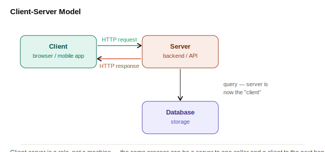

**Key idea:** client/server is a **role**, not a fixed machine. Your API server is a *server* when your browser calls it, but becomes a *client* the moment it queries the database. A single request chain can hop through several client-server relationships in a row.

> Deeper dive already in this journal: `Phase-1/day 02-Client-server model.md` covers the full 1-tier → n-tier evolution and when to split responsibilities across tiers.

**Why it matters:** the split lets client and server evolve independently — you can ship a new mobile app without redeploying the backend, and scale server capacity without touching any client.

> **Interview one-liner:** "Client-server is a role, not a machine — the same process can be a server to one caller and a client to the next hop."

---

## 2. IP Address

**TL;DR:** A unique numeric identifier assigned to every device on a network — the actual destination a packet is routed to, once DNS has done its job.

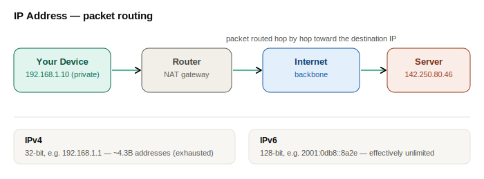

| | IPv4 | IPv6 |
|---|---|---|
| Format | `192.168.1.1` (32-bit) | `2001:0db8:85a3::8a2e:0370:7334` (128-bit) |
| Address space | ~4.3 billion addresses | Effectively unlimited |
| Status | Exhausted; extended via NAT | Rollout in progress, mandatory for growth (IoT, mobile) |

**Public vs private IPs:** private ranges (`10.0.0.0/8`, `192.168.0.0/16`, etc.) are reused inside every home/office network and translated to a public IP at the router via **NAT** — this is why your laptop's "IP address" looks different from what a website sees.

**Design relevance:** every server, load balancer, and database node is ultimately addressed by an IP. DNS, load balancers, and service discovery all exist to answer one question — *which IP do I send this packet to right now?*

> **Interview one-liner:** "IP addresses are the actual routable destination — DNS, load balancers, and service discovery all exist to answer 'which IP, right now?' without hardcoding it."

---

## 3. DNS (Domain Name System)

**TL;DR:** The internet's phonebook — translates a human-readable domain name (`example.com`) into the IP address a machine actually routes to.

**Resolution, step by step:**
1. Browser checks its own cache, then the OS cache.
2. If not cached, it asks a **recursive resolver** (your ISP, or a public one like `1.1.1.1`).
3. Resolver asks a **root server** → gets pointed at the **TLD server** for `.com`.
4. TLD server points to the **authoritative name server** for `example.com`.
5. Authoritative server returns the actual IP (an A/AAAA record).
6. The answer is cached at every hop for the record's **TTL**, so this chain isn't repeated on every request.

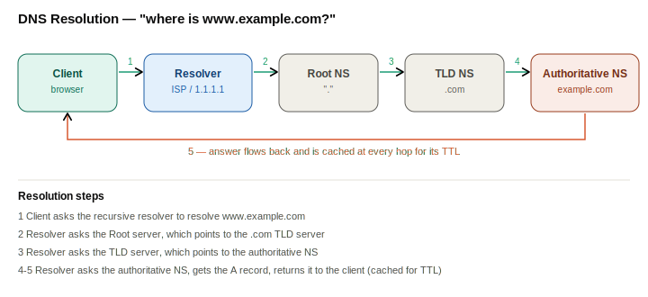

**Common record types:**

| Record | Purpose |
|---|---|
| A / AAAA | Hostname → IPv4 / IPv6 address |
| CNAME | Alias — hostname → another hostname |
| MX | Mail server for the domain |
| NS | Which name servers are authoritative for this zone |
| TXT | Arbitrary text (domain verification, SPF) |

**Design relevance:**
- **TTL is a trade-off knob:** low TTL = fast propagation of changes but heavier resolver load; high TTL = cheaper but slow failover.
- **DNS as a cheap load balancer:** round-robin DNS returns multiple IPs in rotation; **GeoDNS** (Route53, Cloudflare) routes users to the nearest region — global routing before a request ever reaches your infrastructure.
- DNS is also a real failure point — the 2016 Dyn attack took down Twitter and Netflix by attacking DNS, not the origin servers.

> **Interview one-liner:** "DNS is a hierarchical, cacheable lookup chain — and GeoDNS lets me do coarse global routing for free before a request hits my load balancer."

---

## 4. Proxy vs Reverse Proxy

**TL;DR:** A forward proxy sits in front of **clients** and hides them from the server. A reverse proxy sits in front of **servers** and hides them from the client.

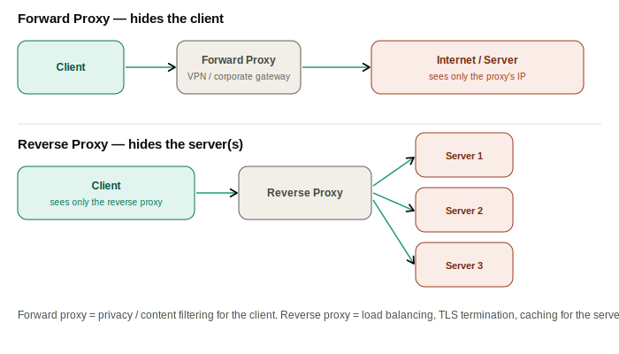

| | Forward Proxy | Reverse Proxy |
|---|---|---|
| Sits in front of | Clients | Servers |
| Hides | The client's identity from the server | The servers' identity/topology from the client |
| Typical uses | Privacy/VPNs, corporate content filtering, bypassing geo-restrictions | Load balancing, TLS termination, caching, compression, security (WAF) |
| Examples | Corporate proxy gateways, VPN services | Nginx, HAProxy, Envoy, Cloudflare |

> **Interview one-liner:** "If it's protecting the client's identity, it's a forward proxy. If it's fronting my servers for load balancing and TLS termination, it's a reverse proxy — and production stacks always have one."

---

## 5. Latency

**TL;DR:** The time a request takes to travel from point A to point B and get processed. Bounded by physics, and one of the most common non-functional requirements you'll be asked to optimize for.

**Where latency comes from:**

| Source | What it is |
|---|---|
| Propagation delay | Physical distance ÷ speed of light in fiber — you cannot beat this |
| Transmission/serialization delay | Time to convert data into bytes/packets and put them on the wire |
| Processing delay | Time the server spends actually handling the request |
| Queuing delay | Time a request waits because the server (or a hop in between) is busy |

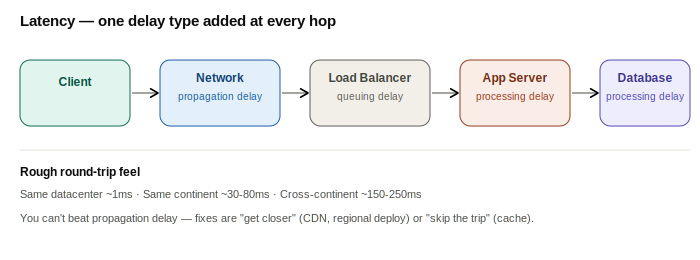

**Rough regional round-trip feel** (order of magnitude, not exact): same-datacenter ~1ms, same-continent ~30-80ms, cross-continent ~150-250ms. A 100ms delay is barely noticeable; users start abandoning around the 1-3 second mark.

**Common mitigations:** CDNs (serve from a nearby edge instead of the origin), caching (skip the database round trip entirely), regional/multi-region deployments (put servers near users), connection reuse/keep-alive (skip repeated handshakes), and compression (fewer bytes to transmit).

**Latency vs throughput:** they're not the same axis — you can have low latency with low throughput (a single fast request) or high throughput with higher per-request latency (batching). Design for the one your use case actually needs.

> **Interview one-liner:** "I can't beat the speed of light, so the fix for latency is almost always 'get closer to the user' (CDN, regional deploy) or 'skip the trip entirely' (cache)."

---

## 6. HTTP and HTTPS

**TL;DR:** HTTP is the request/response language clients and servers speak on the web. HTTPS is the same protocol wrapped in TLS so nobody in between can read or tamper with it.

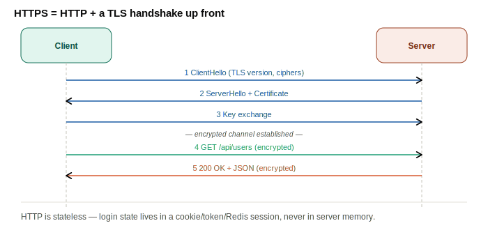

**HTTP is stateless** — the server doesn't remember anything about a previous request. That's what makes horizontal scaling easy (any server can handle any request), but it's also why you need cookies, tokens, or server-side sessions to maintain any notion of "logged in."

**Methods, status codes, headers — the interview cheat sheet:**

| Methods | Status codes | Headers |
|---|---|---|
| GET, POST, PUT, PATCH, DELETE | 2xx success (200, 201, 204) · 3xx redirect (301, 304) · 4xx client error (400, 401, 403, 404, 429) · 5xx server error (500, 502, 503, 504) | `Authorization`, `Content-Type`, `Cache-Control`, `ETag` |

**Why HTTPS costs an extra round trip:** the TLS handshake happens *before* the first HTTP request can go out — that's a real latency cost, which is exactly why HTTP/2's multiplexing and HTTP/3's 0-RTT resumption exist (both keep the encrypted connection alive and reused instead of re-negotiating per request).

> **Interview one-liner:** "HTTP being stateless is a feature for scaling, not a bug — I just need to put the state somewhere shared (cookie, token, Redis session) instead of in server memory."

---

# Group 2 — APIs and Communication

*Once machines can reach each other, applications need a structured contract for exchanging data. This group covers the major API styles plus real-time and event-push patterns.*

## 7. APIs (Application Programming Interfaces)

**TL;DR:** A contract between two pieces of software — it defines what you can ask for, how to ask, and what shape the answer comes back in, without exposing how the other side actually does the work.

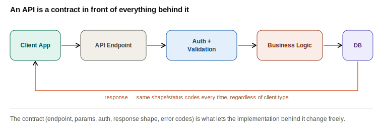

**What an API contract typically specifies:** the endpoint/method, required/optional parameters, authentication requirements, the response shape and status codes, and error semantics. Most modern APIs exchange JSON over HTTP, but the same idea applies to gRPC, GraphQL, or even a plain function signature in a shared library.

**Design considerations that matter beyond "does it work":** versioning (how do you change a contract without breaking existing callers?), authentication/authorization, rate limiting, and documentation (OpenAPI/Swagger so consumers don't have to read your source code).

The next three sections — REST, GraphQL, WebSockets — are the three dominant *styles* of API, each optimized for a different access pattern.

> **Interview one-liner:** "An API is the seam in your system — get the contract right (versioning, auth, error semantics) and the implementation behind it can change freely."

---

## 8. REST API

**TL;DR:** An architectural style for web APIs built on stateless HTTP — everything is a **resource**, identified by a URL, manipulated with standard verbs.

**Core principles:** statelessness (no session state on the server between requests), resource-based URLs (nouns, not verbs), a uniform interface via standard HTTP methods, representations (JSON/XML) instead of the resource itself, and cacheability.

**Verbs mapped to CRUD:**

| Verb | Operation | Idempotent? |
|---|---|---|
| GET | Read | Yes |
| POST | Create | No |
| PUT | Replace (full update) | Yes |
| PATCH | Partial update | No (usually) |
| DELETE | Remove | Yes |

**Example resource design:**

```
GET    /users              → list users
POST   /users              → create a user
GET    /users/{id}         → get one user
PUT    /users/{id}         → replace a user
DELETE /users/{id}         → delete a user
GET    /users/{id}/orders  → nested resource: a user's orders
```

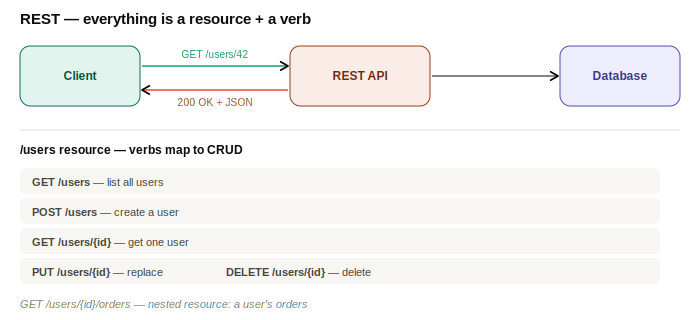

**Trade-offs:** simple, cacheable, stateless, huge tooling/ecosystem support — but prone to **over-fetching** (getting fields you don't need) and **under-fetching** (needing multiple round trips for related data, e.g. `GET /users/42` then `GET /users/42/posts`), and versioning gets awkward as the API evolves.

> **Interview one-liner:** "REST's strength is that HTTP semantics (verbs, status codes, caching) do half the API design for you — its weakness shows up the moment a client needs data shaped differently than your resources."

---

## 9. GraphQL

**TL;DR:** A query language for APIs that lets the client specify exactly which fields it needs, in one request — solving REST's over-fetching/under-fetching problem.

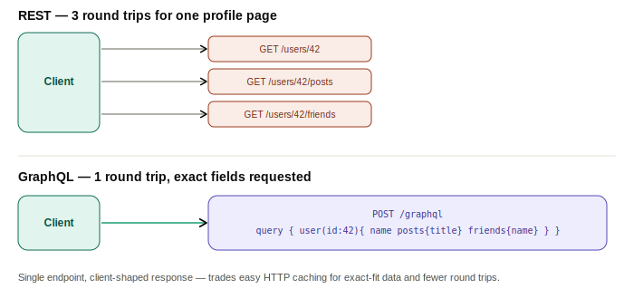

**Schema example (SDL):**

```graphql
type User {
  id: ID!
  name: String!
  posts: [Post!]!
  friends: [User!]!
}

type Post {
  id: ID!
  title: String!
}

type Query {
  user(id: ID!): User
}
```

**Core building blocks:** Query (read), Mutation (write), Subscription (real-time updates), Resolvers (functions that fetch the data for each field) — and, unlike REST, usually a **single endpoint** (`POST /graphql`).

| Pros | Cons |
|---|---|
| Client asks for exactly the fields it needs — no over/under-fetching | Harder to cache at the HTTP layer (everything is a POST to one URL) |
| One round trip for nested/related data | The N+1 query problem in naive resolvers (needs batching, e.g. DataLoader) |
| Strongly typed schema doubles as documentation | Query complexity must be bounded, or a client can request an expensive, deeply nested query |

> **Interview one-liner:** "GraphQL trades REST's easy HTTP caching for exact-fit responses and fewer round trips — the right call when very different client types (web vs mobile) need very different shapes of the same data."

---

## 10. WebSockets

**TL;DR:** HTTP is one-way — the client always initiates. WebSockets upgrade an HTTP connection into a persistent, full-duplex channel so the **server can push to the client** without being asked, which is what real-time features actually need.

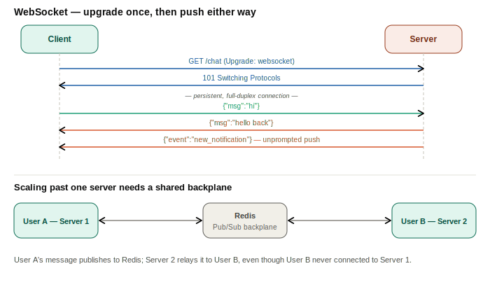

**Why not just poll?** Repeated "anything new?" requests waste bandwidth and add latency. Long-polling (holding a request open until data is ready) is a step up. A **WebSocket** goes further — one persistent connection, either side can send at any time, no per-message handshake overhead. **Server-Sent Events (SSE)** is a lighter middle ground when you only need server→client push (`text/event-stream` over plain HTTP, auto-reconnecting) and don't need the client to talk back on the same channel.

| Approach | Direction | Notes |
|---|---|---|
| Polling | Client→Server, repeated | Simple, wasteful, high latency |
| Long Polling | Client→Server, held open | Server delays the response until data is ready |
| SSE | Server→Client only | Simple, auto-reconnecting, plain HTTP |
| WebSockets | Bidirectional | Full-duplex, persistent, more infra to manage |

**The scaling catch:** a WebSocket connection is *stateful* — it lives on one specific server. That breaks the usual "any server can handle any request" model. Fix: **sticky sessions** at the load balancer, or a shared **pub/sub backplane** (e.g., Redis) so a message published on one server instance reaches sockets held open on another.

*(The scaling diagram above includes the Redis pub/sub backplane setup.)*

**Use cases:** chat apps, live notifications, collaborative editing, live sports scores, multiplayer games.

> **Interview one-liner:** "WebSockets fix HTTP's one-directional limit, but they also make my servers stateful again — I plan the fan-out story (sticky sessions or a pub/sub backplane) before scaling past one instance."

---

## 11. Webhooks

**TL;DR:** The inverse of polling — instead of your app repeatedly asking a third party "did anything happen yet?", you register a callback URL and the third party **POSTs to you** the moment an event occurs.

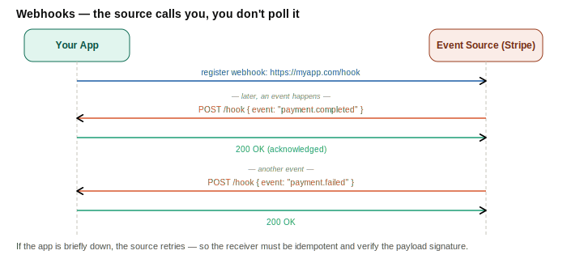

**Reliability is the hard part:** what if your endpoint is down when the webhook fires? A well-built webhook sender retries with backoff and eventually gives up (or dead-letters); a well-built webhook *receiver* must therefore expect duplicate deliveries and handle them with an [idempotency key](#26-idempotency), and should verify a signature (HMAC) on the payload to confirm it really came from the claimed source and wasn't forged.

**Push vs pull, one more time:**

| | Polling | Webhooks |
|---|---|---|
| Who initiates | You, repeatedly | The source, once, when it happens |
| Latency to react | Bounded by poll interval | Near-instant |
| Load on the source | Constant, regardless of activity | Only when something actually happens |
| Failure handling | Simple — just poll again | Needs retries + idempotent receiver |

**Real-world:** Stripe payment events, GitHub push events triggering CI/CD, Twilio delivery-status callbacks.

> **Interview one-liner:** "Webhooks turn 'poll me' into 'call me' — cheaper for both sides, but it shifts the reliability burden onto retries plus an idempotent receiver."

---

# Group 3 — Data Storage

*Once data moves, it has to land somewhere. This group covers database choice, indexing, table design, caching, and where large files belong.*

## 12. Databases

**TL;DR:** A system for organized, durable storage and retrieval. There's no single "best" database — the right type depends on your data's shape and how you access it.

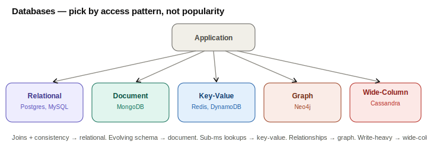

| Type | Best for | Trade-off |
|---|---|---|
| Relational | Transactional data needing joins and strong consistency | Rigid schema, harder to scale horizontally |
| Document | Evolving/nested schemas (product catalogs, content) | Weaker cross-document consistency, no native joins |
| Key-Value | Sub-millisecond lookups by key (sessions, caches) | No querying by value, just by key |
| Graph | Relationship-heavy data (social graphs, recommendations) | Not built for bulk analytical scans |
| Wide-Column | Massive write throughput, time-series/log data | Query patterns must be known upfront (denormalized by design) |

**Design relevance:** most real systems are *polyglot* — an e-commerce platform might keep orders in Postgres (needs ACID) and the product catalog in MongoDB (flexible, read-heavy). The interview-worthy skill isn't knowing every database; it's justifying *why this one, for this access pattern*.

> **Interview one-liner:** "I pick the database by access pattern, not by popularity — joins and strong consistency point at relational, key lookups at sub-millisecond speed point at key-value, deep relationships point at graph."

---

## 13. SQL vs NoSQL

**TL;DR:** SQL databases enforce a strict schema and give you ACID transactions. NoSQL databases trade some of that rigidity for flexible schemas and easier horizontal scaling.

| | SQL | NoSQL |
|---|---|---|
| Schema | Fixed, enforced | Flexible, per-document |
| Consistency | ACID transactions | Usually eventual consistency ([BASE](#24-cap-theorem)) |
| Relationships | Joins across tables | Denormalized/embedded — joins are expensive or unsupported |
| Scaling | Primarily vertical (though modern systems add read replicas/sharding) | Designed for horizontal scaling from day one |
| Examples | PostgreSQL, MySQL | MongoDB, DynamoDB, Cassandra |

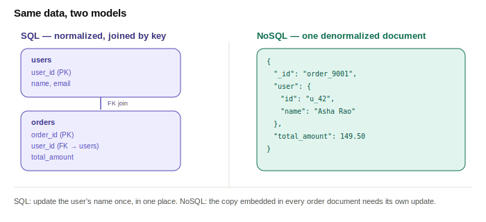

**DDL contrast — same data, two models:**

```sql
-- SQL: normalized, relational
CREATE TABLE users (
  user_id      BIGINT PRIMARY KEY,
  name         VARCHAR(255) NOT NULL,
  email        VARCHAR(255) UNIQUE NOT NULL
);

CREATE TABLE orders (
  order_id     BIGINT PRIMARY KEY,
  user_id      BIGINT NOT NULL REFERENCES users(user_id),
  total_amount NUMERIC(10,2) NOT NULL,
  created_at   TIMESTAMP DEFAULT now()
);
```

```json
// NoSQL (document): denormalized, self-contained
{
  "_id": "order_9001",
  "user": { "id": "u_42", "name": "Asha Rao", "email": "asha@example.com" },
  "total_amount": 149.50,
  "created_at": "2026-07-11T10:00:00Z"
}
```

**Choose SQL when** you need strong consistency (banking, inventory), complex multi-table queries, or a schema that's stable. **Choose NoSQL when** you need horizontal write scale, a schema that evolves often, or data that's naturally document/graph/key-value shaped.

> **Interview one-liner:** "SQL buys me correctness and joins; NoSQL buys me schema flexibility and horizontal scale — most production systems use both, one per subsystem."

---

## 14. Database Indexing

**TL;DR:** Without an index, a lookup means scanning every row. An index is a separate, sorted data structure (usually a **B-Tree**) that turns that scan into an O(log n) lookup.

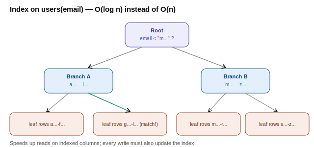

**DDL:**

```sql
-- Single-column index — speeds up WHERE email = ?
CREATE INDEX idx_users_email ON users(email);

-- Unique index — also enforces no duplicates
CREATE UNIQUE INDEX idx_users_email_unique ON users(email);

-- Composite index — speeds up WHERE user_id = ? AND created_at > ?
-- (leftmost-prefix rule: also speeds up WHERE user_id = ? alone)
CREATE INDEX idx_orders_user_created ON orders(user_id, created_at);
```

| Pros | Cons |
|---|---|
| Fast reads/lookups (O(log n) instead of O(n)) | Every INSERT/UPDATE/DELETE must also update the index — slower writes |
| Can enforce uniqueness | Extra storage per index |
| Composite indexes can serve `ORDER BY` and range queries too | Too many indexes on a hot-write table hurts throughput |

**Practical rule of thumb:** index the columns that show up in `WHERE`, `JOIN`, and `ORDER BY` clauses — not every column. Check `EXPLAIN`/query plans to confirm an index is actually being used.

> **Interview one-liner:** "An index is a read/write trade-off I make explicitly per column — I index what shows up in WHERE and JOIN clauses on hot queries, not everything."

---

## 15. Vertical Partitioning

**TL;DR:** Splitting one wide table into several narrower tables **by column**, grouped by access pattern, joined back by a shared key. (Not to be confused with [sharding](#23-sharding), which splits by *row*.)

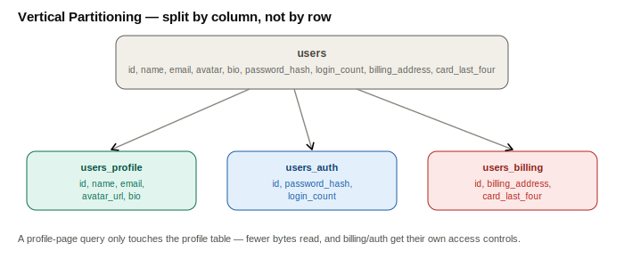

```sql
CREATE TABLE users_profile (
  user_id       BIGINT PRIMARY KEY,
  name          VARCHAR(255),
  email         VARCHAR(255),
  avatar_url    TEXT,
  bio           TEXT
);

CREATE TABLE users_auth (
  user_id         BIGINT PRIMARY KEY REFERENCES users_profile(user_id),
  password_hash   VARCHAR(255) NOT NULL,
  login_count     INT DEFAULT 0
);

CREATE TABLE users_billing (
  user_id           BIGINT PRIMARY KEY REFERENCES users_profile(user_id),
  billing_address   TEXT,
  card_last_four    CHAR(4)
);
```

**Why bother:** a profile-page query never touches billing columns, so it reads fewer bytes off disk and runs faster. It also draws a natural **security boundary** — billing/auth data can get stricter access control and separate encryption — and lets each partition be indexed/optimized independently.

> **Interview one-liner:** "Vertical partitioning splits by column and access pattern within one logical entity — it's a different axis from sharding, which splits the same columns across many rows/nodes."

---

## 16. Caching

**TL;DR:** Store frequently accessed data in a fast layer (usually in-memory) so most reads never touch the database. The single highest-leverage technique for read performance.

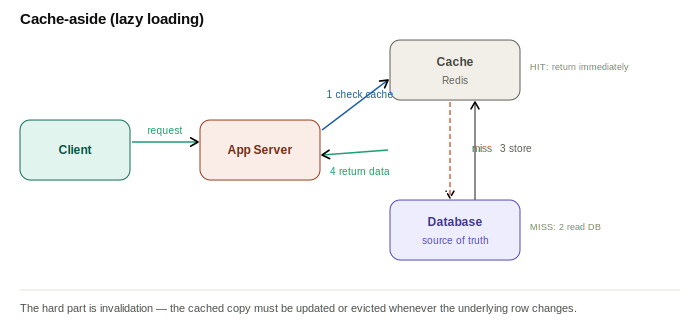

**Common patterns:**

| Pattern | How it works | Trade-off |
|---|---|---|
| Cache-aside (lazy loading) | App checks cache, falls back to DB on miss, then populates cache | Simple, but first request after a miss/expiry is slow |
| Write-through | Write goes to cache and DB together, synchronously | Cache always fresh, but write latency = cache + DB |
| Write-behind (write-back) | Write goes to cache first, DB is updated asynchronously later | Fast writes, but risk of data loss if the cache fails before flushing |
| TTL-based expiry | Every cached entry auto-expires after N seconds | Simple staleness bound, but doesn't handle sudden writes |

**The hard part is invalidation.** When the underlying row changes, the cached copy must be updated or evicted — miss this and you serve stale data indefinitely. Also watch for **cache stampede** (a popular key expires and thousands of requests hit the DB simultaneously) — mitigated with locks, jittered TTLs, or request coalescing.

> **Interview one-liner:** "Caching is easy to add and hard to invalidate correctly — I pick the pattern (aside/through/behind) based on whether I can tolerate stale reads or slower writes."

---

## 17. Denormalization

**TL;DR:** Normalized schemas avoid duplication by splitting data across tables — clean, but joining several tables to render one page is slow. Denormalization deliberately **duplicates** data to cut those joins out of the read path.

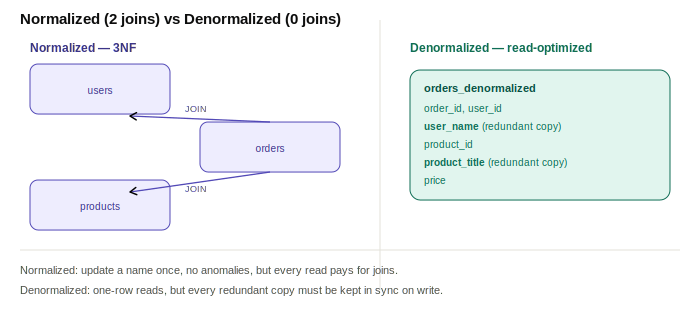

```sql
-- Normalized (3NF)
CREATE TABLE users    (user_id BIGINT PRIMARY KEY, name VARCHAR(255));
CREATE TABLE products (product_id BIGINT PRIMARY KEY, title VARCHAR(255), price NUMERIC(10,2));
CREATE TABLE orders (
  order_id   BIGINT PRIMARY KEY,
  user_id    BIGINT REFERENCES users(user_id),
  product_id BIGINT REFERENCES products(product_id)
);

-- Denormalized — one read, no joins, but redundant copies to keep in sync
CREATE TABLE orders_denormalized (
  order_id      BIGINT PRIMARY KEY,
  user_id       BIGINT,
  user_name     VARCHAR(255),   -- redundant copy of users.name
  product_id    BIGINT,
  product_title VARCHAR(255),   -- redundant copy of products.title
  price         NUMERIC(10,2)
);
```

| | Normalized | Denormalized |
|---|---|---|
| Reads | Slower — needs joins | Fast — single-row read |
| Writes | Update one place, no anomalies | Must propagate updates to every redundant copy (triggers, CDC, dual writes) |
| Storage | Minimal duplication | More storage used |
| Fits best | Write-heavy, OLTP systems | Read-heavy systems, feeds/timelines, NoSQL (no native joins anyway) |

> **Interview one-liner:** "Denormalization is a read-latency optimization I pay for with write complexity — I only reach for it once joins are the actual bottleneck, and I always pair it with a plan for keeping the copies in sync."

---

## 18. Blob Storage

**TL;DR:** Purpose-built storage for large, unstructured binary files — images, videos, backups. These never belong in your relational database; you store the file in blob storage and keep only a **reference URL** in your schema.

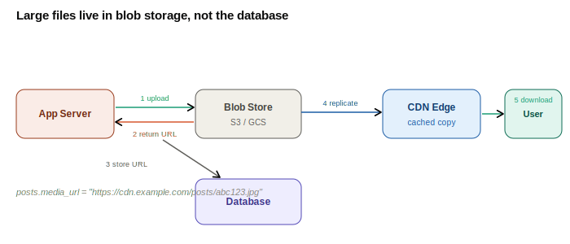

```sql
CREATE TABLE posts (
  post_id     BIGINT PRIMARY KEY,
  user_id     BIGINT NOT NULL,
  caption     TEXT,
  media_url   TEXT NOT NULL,   -- e.g. https://cdn.example.com/posts/abc123.jpg
  created_at  TIMESTAMP DEFAULT now()
);
```

**Why not just store the bytes in the DB?** Your database is optimized for structured, transactional rows — stuffing multi-megabyte blobs into it bloats backups, slows replication, and wastes an expensive storage tier on cheap data. Blob stores (S3, GCS, Azure Blob) are built for exactly this: extremely high durability (S3-class systems advertise "11 nines"), cheap at scale, and they integrate natively with CDNs for fast delivery.

> **Interview one-liner:** "Large binary files go in blob storage, not the database — the database only ever holds a URL, which keeps it small, fast, and cheap to back up."

---

# Group 4 — Scaling

*Your data storage layer is sorted — now what happens when traffic outgrows one machine? Two levers, and they aren't mutually exclusive.*

## 19. Vertical Scaling

**TL;DR:** Scale **up** — give a single machine more CPU, RAM, and faster disks. No architectural changes required, but there's a hard ceiling.

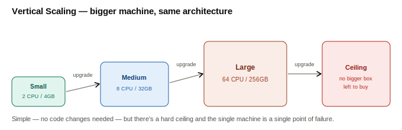

| Pros | Cons |
|---|---|
| Simplest to operate — no distributed-systems complexity | Hard ceiling — largest instance types exist, and cost grows non-linearly near the top |
| No code changes needed | Single point of failure — that one machine going down takes everything with it |
| Enough for many startups/small-to-medium systems | No redundancy by default |

> **Interview one-liner:** "Vertical scaling buys time without buying complexity — it's the right first move, just not a permanent one."

---

## 20. Horizontal Scaling

**TL;DR:** Scale **out** — add more machines and spread load across them. No theoretical ceiling, but the application has to be designed to allow it.

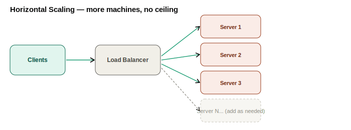

**Requirements for this to actually work:** servers must be **stateless** (any server can handle any request), session data has to live in a shared store (Redis) instead of local memory, you need a **load balancer** in front, and the **database** needs its own scaling strategy — [replication](#22-replication) and/or [sharding](#23-sharding) — since more app servers alone don't help if they're all hammering one DB.

| | Vertical Scaling | Horizontal Scaling |
|---|---|---|
| How | Bigger machine | More machines |
| Ceiling | Hard limit | No theoretical limit |
| Complexity | Low | Higher — statelessness, LB, distributed data |
| Fault tolerance | None (single machine) | Better — one node dying doesn't take the system down |

> **Interview one-liner:** "Horizontal scaling removes the ceiling, but only after I've made the app stateless — that precondition is usually the real design discussion, not the scaling itself."

---

## 21. Load Balancers

**TL;DR:** Sits between clients and a server pool, distributing requests so no single server is overwhelmed, and routing around unhealthy nodes automatically.

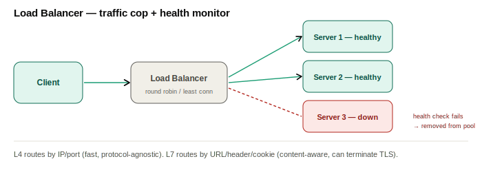

**Layer 4 vs Layer 7:**

| | L4 (Transport) | L7 (Application) |
|---|---|---|
| Routes by | IP + port | URL path, headers, cookies, content |
| Protocol awareness | None — just forwards packets | Understands HTTP — can do content-based routing, TLS termination |
| Speed | Faster (less inspection) | Slightly slower, more flexible |

**Common algorithms:** Round Robin (rotate through servers), Weighted Round Robin (capacity-aware rotation), Least Connections (send to whoever has the fewest active requests), IP Hash (same client always hits the same server — useful for sticky sessions).

**Health checks:** active (LB periodically pings each server) and passive (LB notices failed responses and pulls a server out of rotation). The LB itself needs to avoid being a single point of failure — typically deployed as an active-passive pair with a floating IP, or via DNS across multiple LB endpoints.

**Examples:** Nginx, HAProxy, Envoy, AWS ALB/NLB.

> **Interview one-liner:** "A load balancer buys me two things at once — throughput (spread the load) and availability (route around failures) — and I pick L4 vs L7 based on whether I need content-aware routing."

---

## 22. Replication

**TL;DR:** Keeping copies of the same data on multiple database nodes, for read scale and availability. The most common setup is **leader-follower**: all writes go to the leader, changes propagate to followers that serve reads.

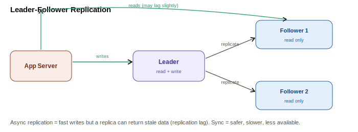

| Topology | How it works | Trade-off |
|---|---|---|
| Single-leader (leader-follower) | One leader takes writes, replicates to N followers | Simple, consistent writes; leader is a bottleneck/SPOF until failover |
| Multi-leader | Several nodes accept writes, replicate to each other | Better write availability across regions; conflicts need resolution |
| Leaderless (quorum-based) | Any node can accept a write; reads/writes require a quorum | High availability; consistency tuned via read/write quorum sizes (Dynamo-style) |

**Sync vs async replication:** synchronous waits for the follower to confirm before acknowledging the write (safer, slower, less available if a follower is down); asynchronous acknowledges immediately and replicates in the background (faster, but a crashed leader can lose the most recent writes).

**Replication lag** is the real-world catch: a read from a follower right after a write to the leader might return stale data. Fine for a social feed; not fine for "did my payment go through?" — for the latter, read from the leader, or use read-your-writes consistency (route a user's own reads to the leader/whichever replica just served their write).

> **Interview one-liner:** "Replication buys read scale and availability, and its cost is replication lag — I decide per-endpoint whether stale-by-a-few-hundred-ms is acceptable or whether that read has to hit the leader."

---

## 23. Sharding

**TL;DR:** Splits data **horizontally** across multiple nodes — each shard holds a different subset of rows (unlike replication, where every node has everything). This is how you scale writes and total storage past what one node can hold.

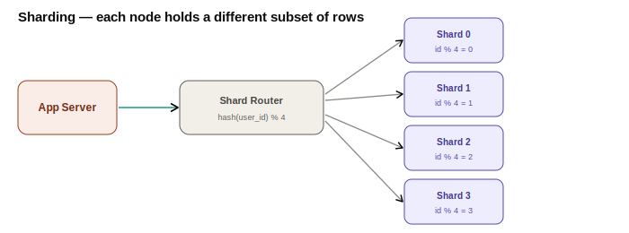

```sql
-- Each shard is a physically separate database holding the same schema,
-- but only the rows whose shard key routes to it.
CREATE TABLE users_shard_0 (
  user_id  BIGINT PRIMARY KEY,   -- only rows where user_id % 4 = 0 live here
  name     VARCHAR(255),
  email    VARCHAR(255)
);
-- users_shard_1, users_shard_2, users_shard_3 mirror this schema
```

**Partitioning strategies:**

| Strategy | How | Risk |
|---|---|---|
| Hash-based | `hash(key) % N` picks the shard | Even distribution, but range queries ("all orders in March") hit every shard |
| Range-based | Key ranges assigned to shards (`A-M` → shard 1) | Range queries stay on one shard, but easily creates hot shards (e.g. all of today's orders on one shard) |
| Directory-based | A lookup service maps key → shard explicitly | Flexible rebalancing, but the lookup service is a new dependency/SPOF |

**Real challenges:** cross-shard queries and joins are expensive or impossible without an app-level fan-out; rebalancing when you add a shard means physically moving data to rebuild the `key → shard` mapping; and a poorly chosen shard key creates **hot shards** (a celebrity user, a viral product) that overload one node while the rest sit idle.

> **Interview one-liner:** "Sharding scales writes and storage, but the shard key is the whole design — pick wrong and you either can't do range queries efficiently or you build a hot shard."

---

# Group 5 — Distributed Systems

*Once you're running multiple servers and databases across a network, a new class of problem shows up: things that were trivial on one machine (consistency, "did this happen exactly once?") become genuinely hard when machines fail independently and networks partition.*

## 24. CAP Theorem

**TL;DR:** A distributed system can only guarantee two of three properties at once — **C**onsistency (every read gets the latest write), **A**vailability (every request gets a response), **P**artition tolerance (the system keeps working when network links between nodes fail).

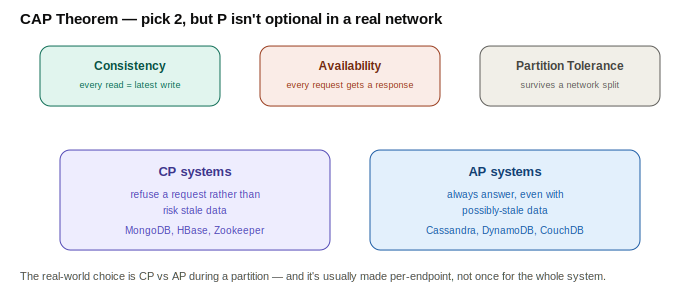

**The real-world nuance:** network partitions *will* happen, so partition tolerance isn't really optional for any distributed system — the actual choice engineers make is **CP vs AP** *during* a partition: reject/block requests to stay correct (CP), or keep answering with possibly-stale data (AP).

| | CP (favors Consistency) | AP (favors Availability) |
|---|---|---|
| Behavior during a partition | Refuses requests it can't guarantee are up to date | Always responds, even with potentially stale data |
| Good fit | Banking, inventory, anything where stale data causes real damage | Social feeds, product catalogs, analytics — availability matters more than perfect freshness |
| Examples | MongoDB (strong consistency mode), HBase, Zookeeper, traditional single-leader RDBMS | Cassandra, DynamoDB, CouchDB |

> **Interview one-liner:** "Partition tolerance isn't a choice in a real network — the actual trade-off I make is CP vs AP for *during* a partition, and I make that call per use case, not once for the whole system."

---

## 25. CDN (Content Delivery Network)

**TL;DR:** A globally distributed network of edge servers (PoPs) that cache content close to users — instead of every request traveling to one origin, most are served from the nearest edge.

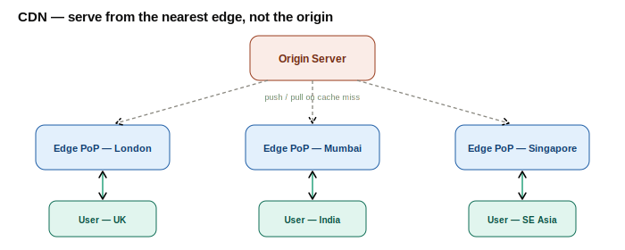

**Pull vs push CDN:**

| | Pull CDN | Push CDN |
|---|---|---|
| How content lands at the edge | Edge fetches from origin on first request (cache miss), then serves from cache | You proactively upload content to the CDN ahead of time |
| Best for | Dynamic/frequently changing, unpredictable traffic | Large, rarely-changing files (videos, releases) you want pre-warmed |
| First request in a region | Slower (cache miss round trip) | Fast — already warmed |

**What it's for beyond static assets:** video streaming (HLS/DASH segments), absorbing volumetric DDoS traffic at the edge before it reaches origin, and increasingly, edge compute (Cloudflare Workers, Lambda@Edge) running logic at the PoP itself.

**Cache invalidation:** TTL expiry (simplest, stale until it lapses), explicit purge/invalidate calls, or versioned/cache-busted URLs (`app.js?v=hash`) so a new deploy is a new cache key instead of requiring invalidation at all.

> **Interview one-liner:** "A CDN turns 'latency to origin' into 'latency to nearest edge PoP' — for a global user base, that's usually the single highest-leverage latency fix available, and it doubles as free DDoS absorption."

---

## 26. Idempotency

**TL;DR:** An operation is idempotent if running it once or running it ten times produces the **same result**. In distributed systems, where a timeout doesn't tell you whether the server actually processed your request, idempotency is what makes retries safe.

**The problem it solves:** a network blip after the server has already processed a payment leaves the client unsure whether it succeeded. Blindly retrying a non-idempotent `POST /payments` can double-charge the customer.

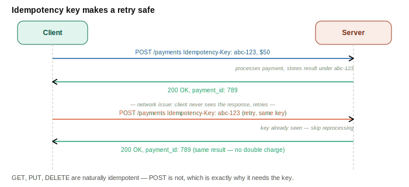

**Naturally idempotent HTTP verbs:** `GET`, `PUT`, `DELETE` (repeating them produces the same end state). `POST` is not — which is exactly why you attach a client-generated **idempotency key** to it.

```sql
CREATE TABLE idempotency_keys (
  idempotency_key  VARCHAR(255) PRIMARY KEY,
  request_hash     VARCHAR(64) NOT NULL,   -- guards against key reuse with a different payload
  response_body    JSONB,
  status_code      INT,
  created_at       TIMESTAMP DEFAULT now()
);
```

**Real-world:** Stripe and PayPal require an idempotency key on every payment-creation call for exactly this reason.

> **Interview one-liner:** "Idempotency is what makes 'just retry on timeout' a safe default instead of a data-corruption risk — I reach for it on every write endpoint where a duplicate would cause real damage (payments, order creation)."

---

# Group 6 — Architecture Patterns

*The building blocks are covered — this last group is about how you actually organize all of them into a coherent, large-scale system.*

## 27. Microservices

**TL;DR:** Splitting an application into small, independently deployable services, each owning a single business capability and — critically — its own datastore.

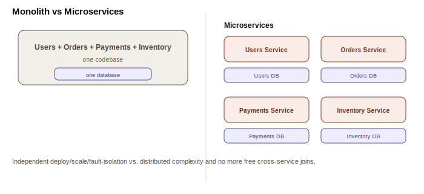

> Deeper dive already in this journal: `Phase-1/day 02-Client-server model.md` covers the full monolith → n-tier → microservices evolution and the "what breaks if I don't split" test for when it's actually worth it.

| Pros | Cons |
|---|---|
| Independent deploy, scale, and tech choice per service | Distributed complexity — network calls replace function calls |
| Fault isolation (one service crashing doesn't take everything down) | No shared DB means no easy cross-service joins/transactions |
| Teams can own services independently (organizational scaling) | Real operational overhead — monitoring, service discovery, deployment pipelines per service |

> **Interview one-liner:** "Microservices trade a simple codebase for independent scaling and fault isolation — worth it once a specific component's scale or team-ownership needs demand it, not by default."

---

## 28. Message Queues

**TL;DR:** An intermediary that decouples a producer from its consumers — the producer drops a message and moves on; each consumer processes it at its own pace, even if it's temporarily down.

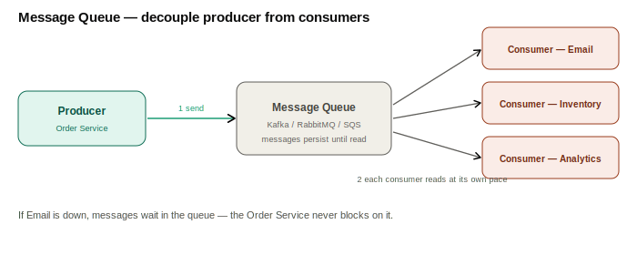

**What it buys you:** decoupling (the producer doesn't need to know who's listening, or wait for them), buffering (absorb traffic spikes instead of failing under load), reliability (messages persist until consumed, even through a consumer crash), and independent scaling (add more consumers to drain the queue faster).

**Delivery guarantees:**

| Guarantee | Meaning | Typical cost |
|---|---|---|
| At-most-once | Message delivered 0 or 1 times | Fastest, but silent message loss is possible |
| At-least-once | Message delivered ≥ 1 times | Requires the consumer to be [idempotent](#26-idempotency) to handle duplicates |
| Exactly-once | Message delivered exactly 1 time | Hardest/most expensive to guarantee end-to-end; usually approximated via at-least-once + idempotent consumers |

**Examples:** Kafka (high-throughput event streaming, partitioned log, consumer groups), RabbitMQ (traditional broker with flexible routing), SQS (managed, simple point-to-point queue).

> **Interview one-liner:** "A message queue turns 'the caller waits for me' into 'the caller drops it and moves on' — and every downstream failure becomes a queue backlog instead of a cascading outage."

---

## 29. Rate Limiting

**TL;DR:** Caps how many requests a client can make in a given time window, protecting the backend from abuse, accidental overload, and runaway cost.

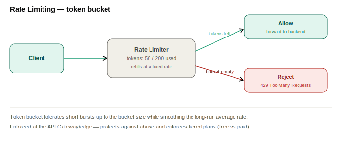

**Common algorithms:**

| Algorithm | How it works | Trade-off |
|---|---|---|
| Token bucket | Tokens refill at a fixed rate; each request consumes one; empty bucket = reject | Allows short bursts up to the bucket size; smooth long-term rate |
| Fixed window counter | Count requests in discrete windows (e.g. per minute), reset each window | Simple, but allows a burst of 2x the limit right at a window boundary |
| Sliding window | Count requests in a rolling time window instead of a fixed boundary | Smooths out the boundary-burst problem, costs more to compute |

```sql
-- A relational approximation; in practice this is almost always Redis
-- (INCR + EXPIRE) because it needs to be fast and cheap to update per-request.
CREATE TABLE rate_limit_buckets (
  client_id       VARCHAR(100) PRIMARY KEY,
  tokens          INT NOT NULL,
  last_refill_at  TIMESTAMP NOT NULL
);
```

**Where it's enforced:** typically at the [API Gateway](#30-api-gateway) or edge, sometimes also client-side as a best-effort courtesy. **Use cases:** absorbing DDoS/abusive traffic, protecting expensive downstream calls (a slow DB query, a paid third-party API), and enforcing tiered plans (free = 100 req/min, paid = 10,000 req/min).

> **Interview one-liner:** "Rate limiting is cheap insurance against one bad client (malicious or just buggy) taking down the experience for everyone else — token bucket is my default because it tolerates bursts without letting the average rate drift."

---

## 30. API Gateway

**TL;DR:** A single entry point in front of all backend services — instead of clients talking directly to a dozen services, they talk to the gateway, which handles routing, auth, and other cross-cutting concerns centrally.

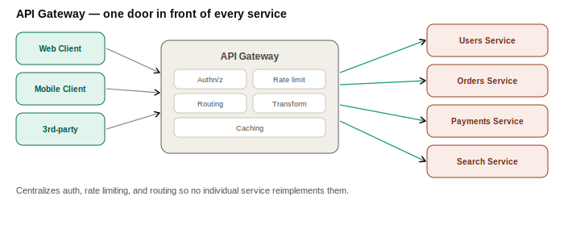

**What it centralizes:** request routing, authentication/authorization, [rate limiting](#29-rate-limiting), request/response transformation, protocol translation, response caching, and API composition — combining several backend calls into one client-facing response (the **Backend-for-Frontend / BFF** pattern). Without it, every microservice would reimplement auth and rate limiting independently.

| Pros | Cons |
|---|---|
| One place to enforce auth, rate limits, logging — not duplicated per service | Can become a bottleneck or single point of failure if not made highly available |
| Decouples clients from internal service topology — services can move/split freely | Adds a network hop → extra latency |
| Enables client-specific response shaping (BFF) | Risk of becoming a "God object" absorbing business logic it shouldn't own |

**Examples:** Kong, AWS API Gateway, Nginx, Netflix Zuul / Spring Cloud Gateway.

> **Interview one-liner:** "The API Gateway is where every concern that's identical across all my services lives — auth, rate limiting, routing — so each service downstream can stay focused purely on its own business logic."

---

## How the six groups connect

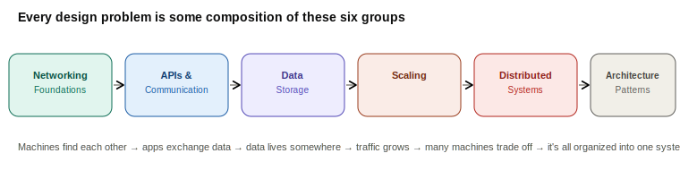

Every real system design problem is some composition of these 30 ideas — a client hitting an API behind a gateway and load balancer, backed by a sharded, replicated, cached database, with async work pushed onto a queue. Once each piece is second nature, the actual interview skill is just picking the *right* subset and justifying the trade-off, out loud, for the specific constraints you were given.

---

## Further Study

- **ByteByteGo** — https://www.youtube.com/@ByteByteGo
- **System Design Primer** — https://github.com/donnemartin/system-design-primer
- **roadmap.sh — System Design** — https://roadmap.sh/system-design
- This journal's own daily notes: `Phase-1/day 01-what is system design.md` and `Phase-1/day 02-Client-server model.md` go deeper on the interview framework and the tier-evolution story than this cheat sheet does by design — this doc is the fast-recall layer, those are the full derivations.

